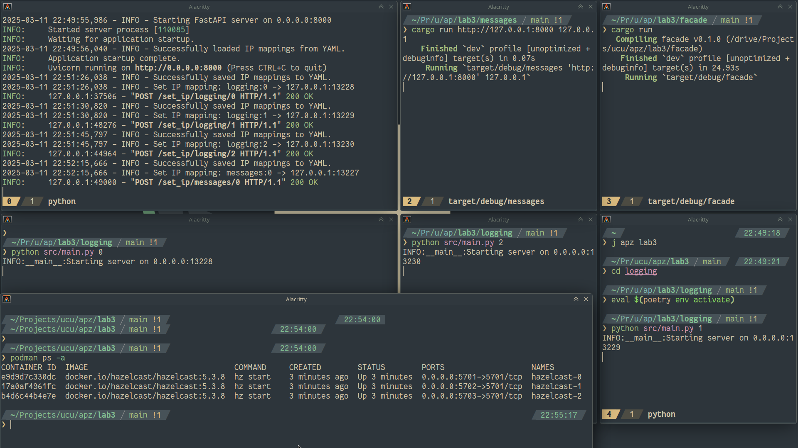
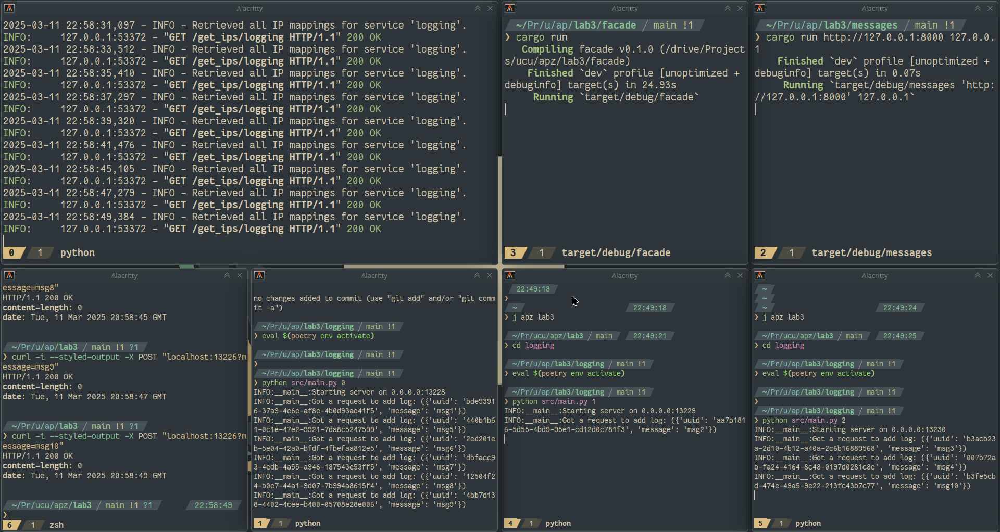
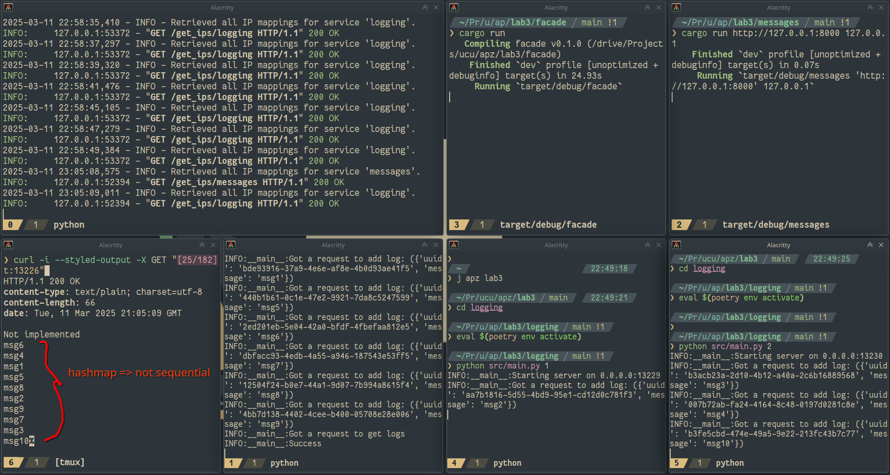
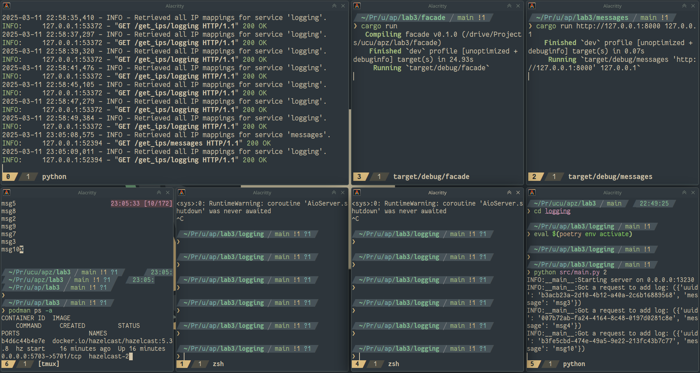
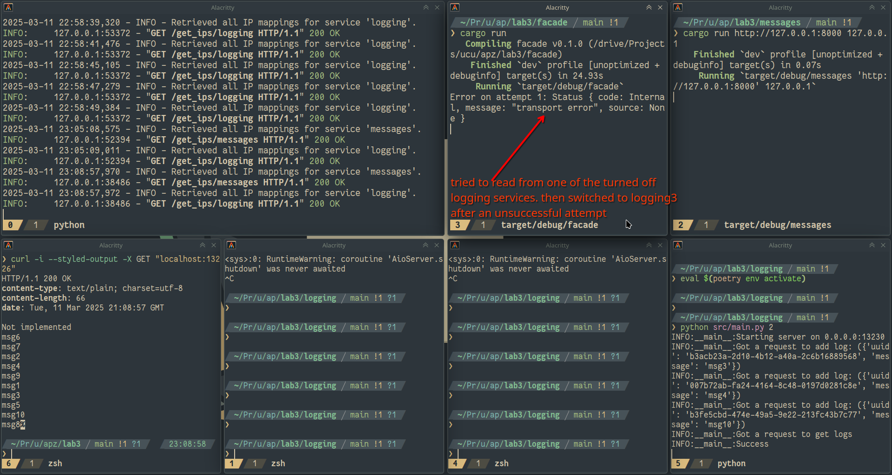
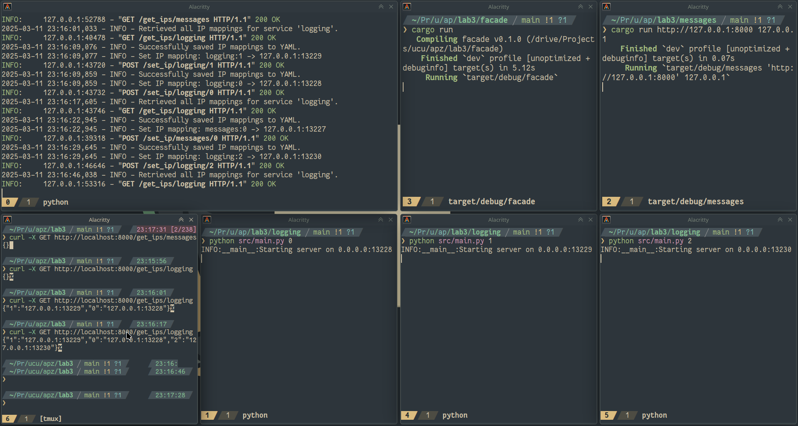

https://github.com/rhusiev-student/s6_apz_lab3/tree/micro_hazelcast

# Запуск сервісів

# Запис 10 повідомлень

Вони розподілені між трьома logging екземплярами:

# Читання повідомлень

# Два екземпляри logging "впали"

Разом з ними автоматично закриваються hazelcast ноди

# Читання, коли перші два logging "впали"

Спершу пробує записати в якийсь із тих, що "впали". Потім з другої спроби дістається до працюючого екземпляру:

# Увесь цей час існує собі config сервіс

**Коли з'являються** logging чи messages сервіси, то вони **динамічно** кажуть йому свою адресу та свій номер

Потім facade питає в config, які існують адреси - він видає список зареєстрованих екземплярів

